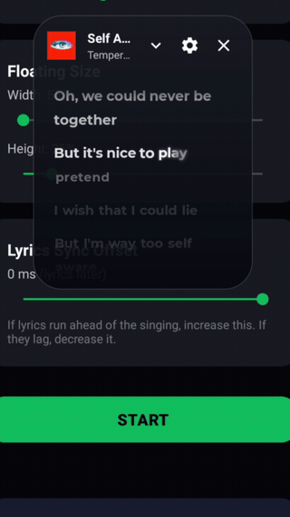

# LyricSync

Floating synced lyrics on top of whatever you're playing.

It reads what's playing from the media notification (Spotify, YT Music, etc.), pulls the lyrics, and shows them in a draggable overlay that highlights word-by-word as the song goes. Word-level timing comes from SpicyLyrics when the track has it, otherwise it falls back to line-synced lyrics from Netease or LRCLIB.

## Preview

<p align="center">
  
</p>

## What it does
- Word / syllable highlighting that follows the beat, with a smooth spring scroll
- **8 lyric animation styles** — Spring Pop, Bubble, Wave, Pulse, Rise, Typewriter, Calm, Neon Glow — each with its own spring physics, pickable from the app or the overlay (live animated previews in the app)
- **Font picker** — Montserrat, Poppins, Barlow, Lato, or the system font, all bundled (OFL) so no downloads are needed
- Auto-syncs to the player position (no manual seeking) and self-corrects drift
- **Tap any line to jump the player there**
- **Playback controls** (previous / play-pause / next) right in the overlay
- **Colour picked from the album art** — the overlay retints itself each track, including covers loaded from URIs
- Bubble-motion overlay: springy entrance, track-change pulse, and settle-on-drop drag physics
- Manual offset slider if a song is still a touch early or late
- Album art, adjustable size, font scale, and a per-song sync tweak
- Draggable anywhere on screen; position is remembered and stays on-screen
- Works over any music app that posts a media notification

## Setup
1. Install the APK
2. Grant **Notification access** (so it can see what's playing) and **Display over other apps**
3. Hit start, play a song, done

Needs Android 8.0+.

## Build
Debug APK is built on every push via GitHub Actions and uploaded as the `LyricSync-debug` artifact. Locally:

```
./gradlew assembleDebug
```

Lyrics come from SpicyLyrics, Netease and LRCLIB. Not affiliated with any of them, or with Spotify.
